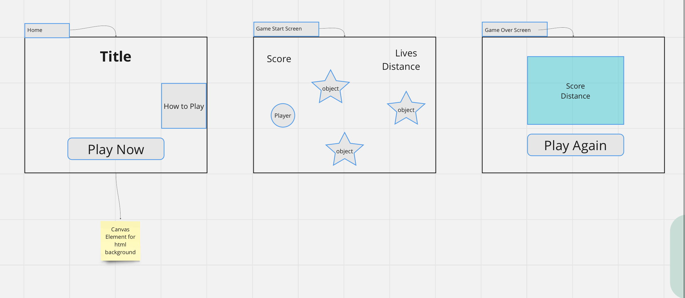
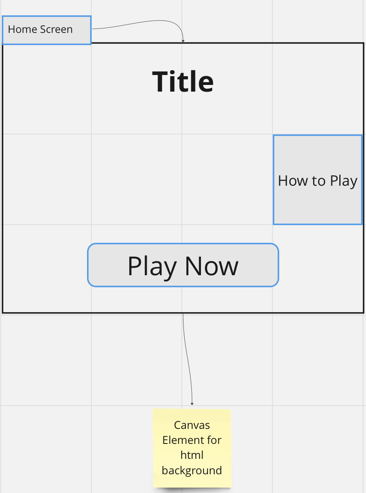
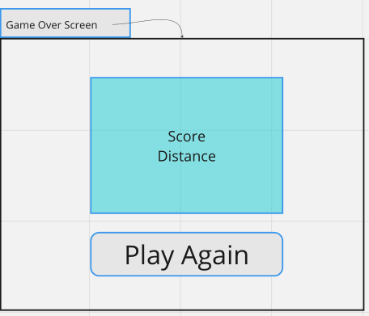
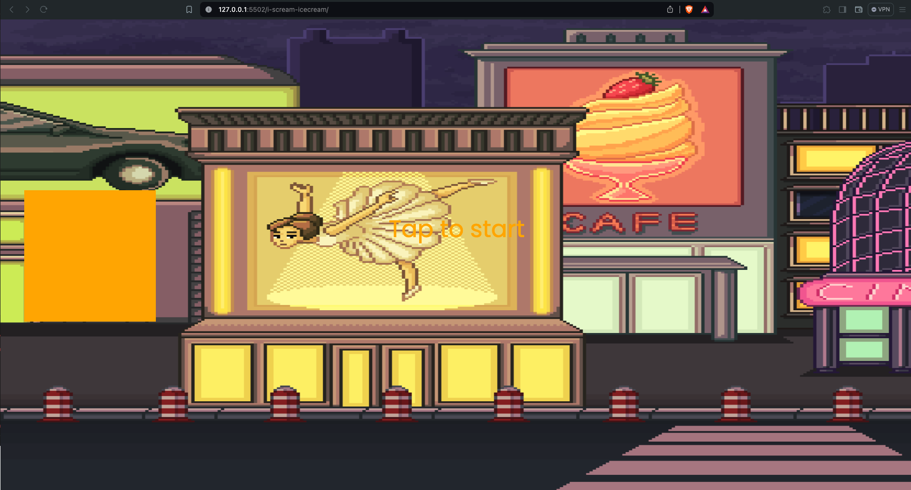
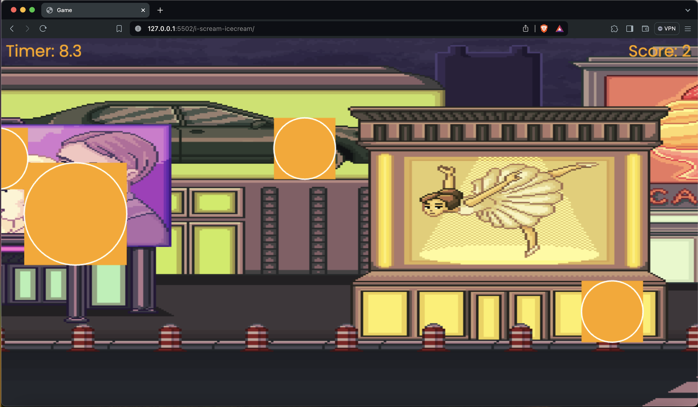
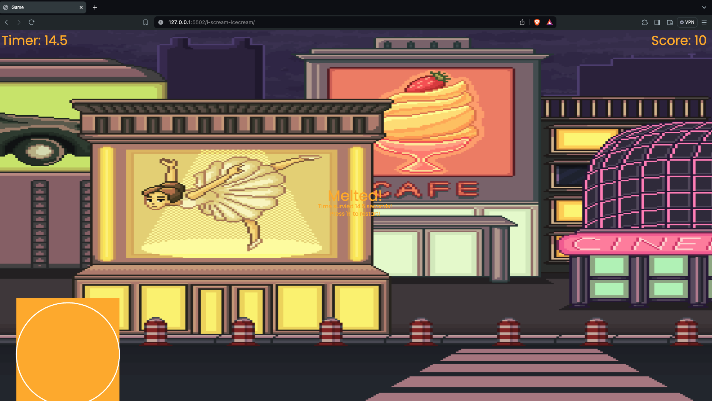

I Scream IceCream
SEI SEBPT220 Project 1: The last iceyPop

A flappy bird inspired survial game

HOW TO PLAY

Start Up Screen:
Main Menu
How To Play
SpaceBar,Tap or Click to move

Game Start Screen:
Play Screen

Game Over Screen:
Score History

HOW TO INSTALL
Fork and Clone this respository to your local machine
Open index.html in your browser to play or
Open the directory in your text editor of choice to view or edit the code

HOW IT WORKS
The Last iceyPop runs on is sidescrolling game loop that. There is one gravity function: tbat forces the IceCream down. There are Obsticals that will cauase the IceCream to melt

Sited Resources:
https://mixkit.co/free-sound-effects/game/
https://craftpix.net/freebies/free-cartoon-parallax-2d-backgrounds/
https://www.youtube.com/watch?v=jj5ADM2uywg

Inital WireFrame Concepts:

Home Screen

Game Start Screen

Game Over Screen

Update WireFrames:

Home Screen

Game Start Screen

Game Over Screen

