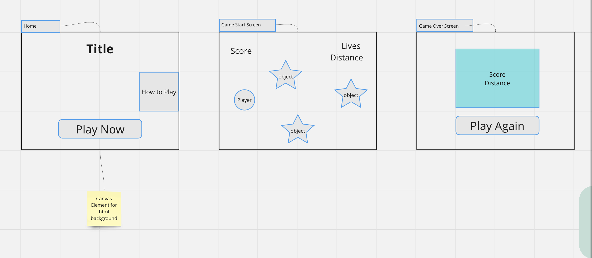
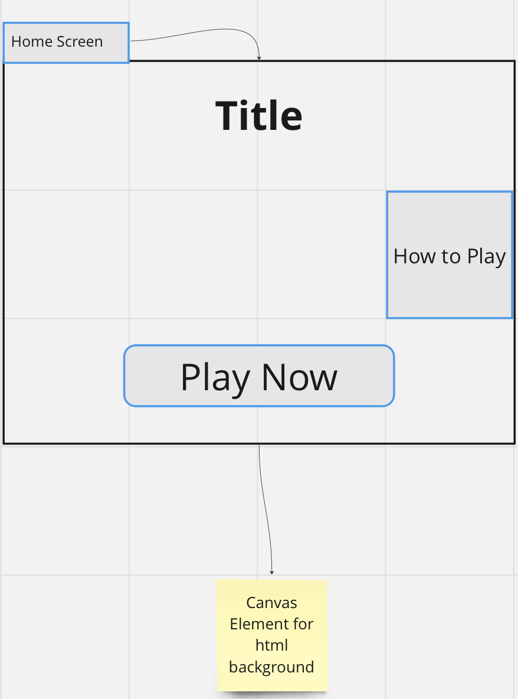
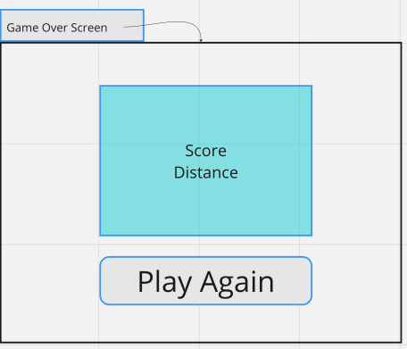
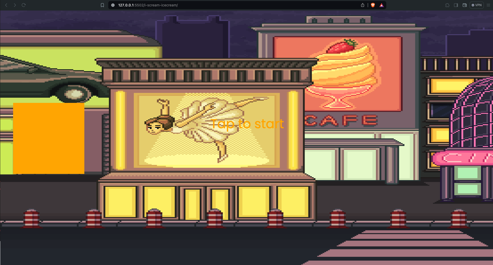
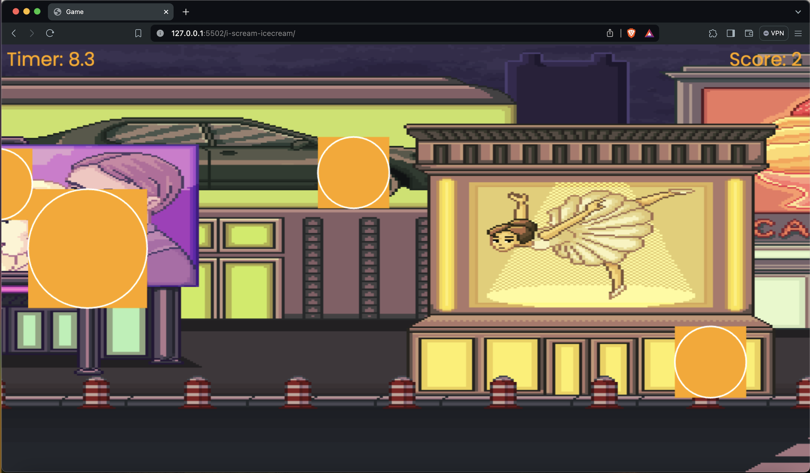
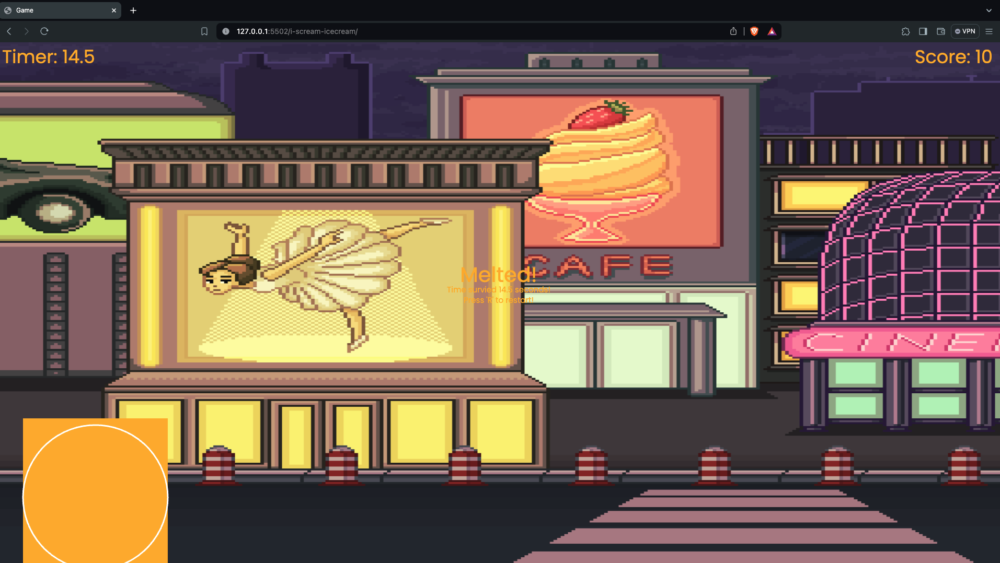

I Scream IceCream
SEI SEBPT220 Project 1: The Last Icey

A Flappy Bird-inspired survival game.

HOW TO PLAY

Start Up Screen:
Main Menu
How To Play
SpaceBar, Tap, or Click to move
Arrow Up / Down or W / S also move the icey-pop

Game Start Screen:
Play Screen

Game Over Screen:
Press R to restart

HOW TO INSTALL
Fork and clone this repository to your local machine.
Open `index.html` in your browser to play, or
open the directory in your text editor of choice to view or edit the code.

HOW IT WORKS
The Last IceyPop runs on a side-scrolling game loop. There is one gravity function that forces the icey-pop down. There are obstacles that will cause the icey-pop to melt on contact.

timeStamp
`timeStamp` is a value in milliseconds built into `requestAnimationFrame`.
`deltaTime` is the difference between the current and previous logged times.
`requestAnimationFrame` automatically adjusts the speed of refresh to the media &mdash; for example, ~60fps depending on the device.

```js
let previousTime = 0;
function animate(timeStamp) {
  // deltaTime is the difference of previousTime and current frame
  const deltaTime = timeStamp - previousTime;
  previousTime = timeStamp;
  ctx.clearRect(0, 0, canvas.width, canvas.height);
  game.render(deltaTime);
  requestAnimationFrame(animate);
}
requestAnimationFrame(animate);
```

Random obstacle position and speed

To add complexity and AI-like behavior to the game, the obstacles randomize their starting positions and direction:

`this.y` sets the position of the object on the y axis to random and keeps it scaled to the game's height.
`this.speedY` randomizes the direction based on a 50/50 probability.

```js
// randomize obstacles on the Y axis
this.y = Math.random() * (this.game.height - this.scaledHeight);
this.speedY = Math.random() < 0.5 ? -1 * this.game.ratio : 1 * this.game.ratio;
```

Stretch Goals:

Game logic:
Incorporate increasing difficulty the longer the player is alive. Possibly spawn 2 additional obstacles for every 20 seconds the user survives.

Give the player a health bar &mdash; the more the player moves, the faster the ice-pop melts. The user would have to grab health-restoring objects.

Animation:
Updating the player to reflect different states in the game would be another addition &mdash; images for melting, melted, moving, and collision frames.

Background Music (optional):
Drop a looping audio file at `assets/sounds/bg-music.mp3` and it will auto-play
on the first user interaction. Missing file = silent (no error). Recommended
sources for free, game-friendly tracks:

- https://pixabay.com/music/ &mdash; CC0-equivalent, no attribution required
- https://opengameart.org/ &mdash; purpose-built for game devs, filter by CC0
- https://soundimage.org/ &mdash; Eric Matyas, CC-BY 4.0 (credit him)
- https://incompetech.com/ &mdash; Kevin MacLeod, CC-BY 4.0
- https://freesound.org/ &mdash; mostly SFX but also loops

Cited Resources:
https://mixkit.co/free-sound-effects/game/
https://craftpix.net/freebies/free-cartoon-parallax-2d-backgrounds/
https://www.youtube.com/watch?v=jj5ADM2uywg

Initial WireFrame Concepts:

Home Screen


Game Start Screen


Game Over Screen


Updated WireFrames:

Home Screen


Game Start Screen


Game Over Screen

